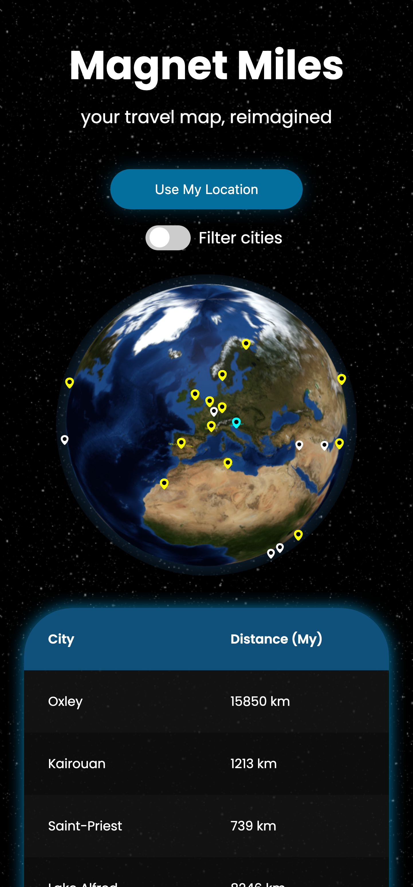

# 🧲 Magnet Miles

A Vue 3 app that calculates distances from your location to random cities, using two different Haversine formula implementations. It also includes a fun challenge with a custom data column about souvenir magnets.

---

## ✨ Features

- Load a random selection of 25 cities from a local server
- Calculate distances from your current location
- Recalculate distances from any clicked city
- Show two distance calculations: 
  - **My own Haversine formula**
  - **AI-generated formula**
- Responsive table with city info and distances
- Optional Fun Challenge:
  - **Custom Data Column**: "Do I have a souvenir magnet?" (+ filter toggle)

---

## 🛠️ Tech Stack

- **Frontend**: Vue 3 (Composition API), Pinia, TypeScript
- **Backend**: Express.js (TypeScript)

---

## 📥 Installation

1. Clone the repository:
   ```bash
   git clone git@github.com:nyanSpruk/authoring-tools-internship-task.git
   cd authoring-tools-internship-task
   ```

2. Install dependencies:
   ```bash
   # Frontend
   cd front_app/
   npm install
   
   # Backend
   cd server/
   npm install
   ```

3. Start the local server:
   ```bash
   cd server/
   npm run dev
   ```

4. Start the frontend app:
   ```bash
   cd front_app/
   npm run dev
   ```

5. Open [http://localhost:5173](http://localhost:5173) in your browser.

---

## 🧪 How to Use

- When the app loads, it fetches **25 random cities** from the server.
- Allow location access when prompted to calculate distances.
- Click on any **city row** to recalculate distances from that city.
- Use the toggle to **filter** cities from the countries where I have a magnet souvenir.
- Clicking a city on the globe, it will recalculate distances from that city.
- Hovering over a city will show its name and distance from the selected city.

---

## 📸 Screenshots / Demo

<p align="center">
  
</p>

<p align="center">
  
</p>


https://github.com/user-attachments/assets/286f6573-7f7b-4123-b152-834a9035acbf


---

## 📘 Notes

### Local Server

Built using Express.js + TypeScript to serve city data:
- `/cities` – paginated list (default 25 cities)
- `/cities/random` – random selection (default 25 cities)

Example API calls:
```bash
GET /cities/random?count=10
GET /cities?page=2
```

### Distance Calculation

- **My Implementation**: `haversineDistanceMine`  
  → Manual Haversine formula (from [Wikipedia](https://en.wikipedia.org/wiki/Haversine_formula))  
- **AI Implementation**: `haversineDistanceAI`  
  → Generated by **ChatGPT o4-mini-high** using a custom prompt.  

Both functions are located in:  
`front_app/src/functions/distance.ts`

### Fun Challenge - Custom Data Column

- "Magnet Owned?" column added, showing if I have a souvenir magnet from that country.
- Data fetched from my personal API: [api.nyanspruk.com](https://api.nyanspruk.com)
- Full visual collection at: [magnets.nyanspruk.com](https://magnets.nyanspruk.com)

---

## 🤖 AI Usage

I used **ChatGPT** to assist in several parts of the project:

- **Code Refactoring**:  
  Helped me optimize and clean up some TypeScript and Vue-specific structures, especially around state management with Pinia and component organization.
  
- **Vue Features**:  
  Assisted with best practices for Composition API usage, such as properly structuring `setup()` functions and reactive states.
  
- **Distance Calculation**:  
  Generated the second version of the Haversine formula, providing clean and easy-to-understand TypeScript code along with param/return explanations.
  
- **README Writing**:  
  Helped polish the README structure and wording for better clarity and professionalism.

---
